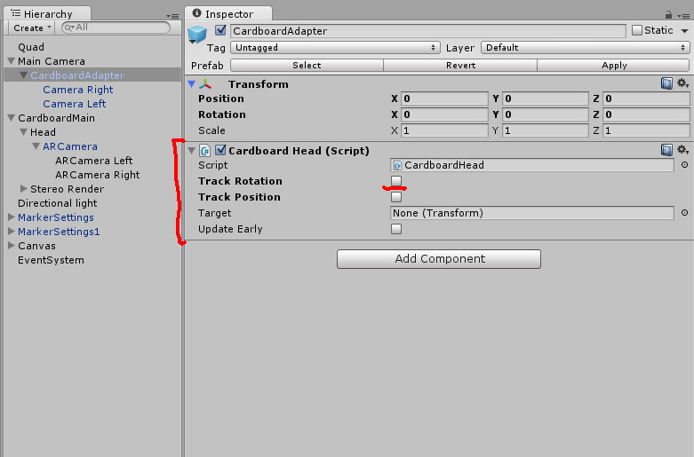
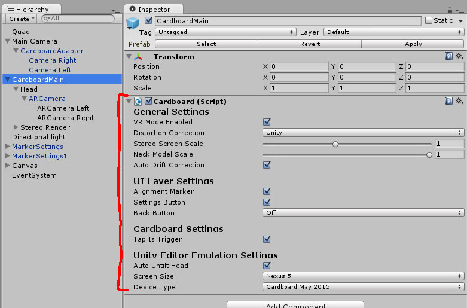

Cardboard With OpenCVForUnity Sample
====================

Screen Shot
-----

Environment
-----
Windows 8.1  
Unity 5.3.3f1  
OpenCVForUnity2.0.4  
Cardboard SDK for Unity v0.6

Setup
-----
* Create New Project. (CardboardMarkerBasedARSample)
* Import OpenCVForUnity2.0.4 from AssetStore  
* Import MarkerBased AR Sample1.1.7 from AssetStore  
* Import CardboardSDKForUnity0.6.unitypackage  
* Import CardboardWithOpenCVForUnitySample.unitypackage 
* Change Product Name. (CardboardMarkerBasedARSample)  
* Change PlayerSettings.bundleIdentifier. (xxx.xxxxxxx.cardboardmarkerbasedarsample)  
* Add the “Assets/CardboardWithOpenCVForUnitySample/Scenes/*.unity” files to “Scenes In Build” list in “Build Settings” window.

  
  
  
  
  
