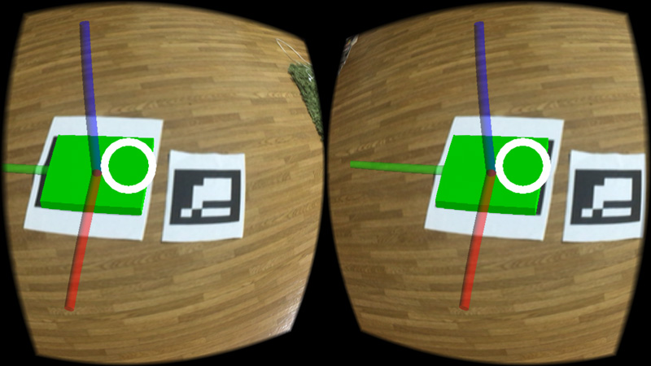
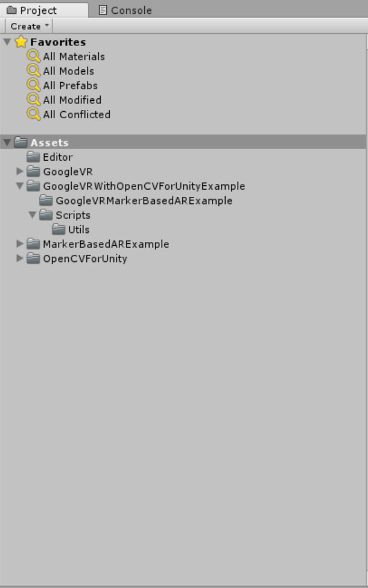
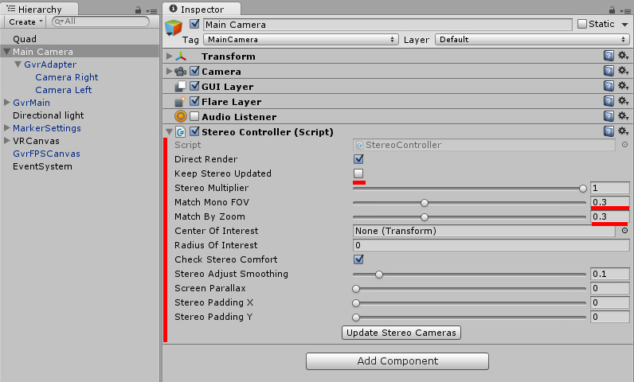
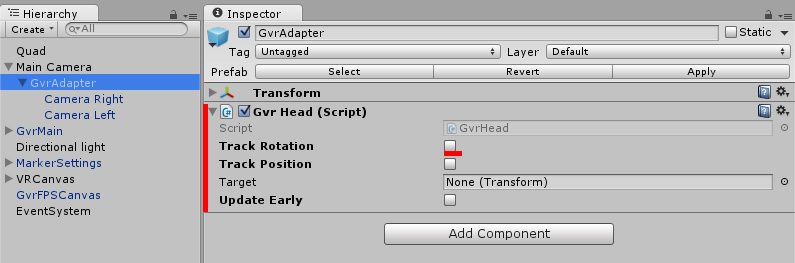
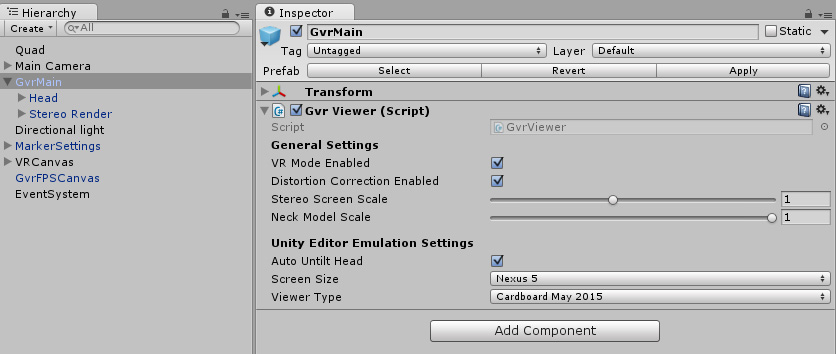
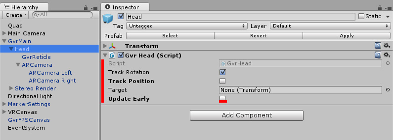
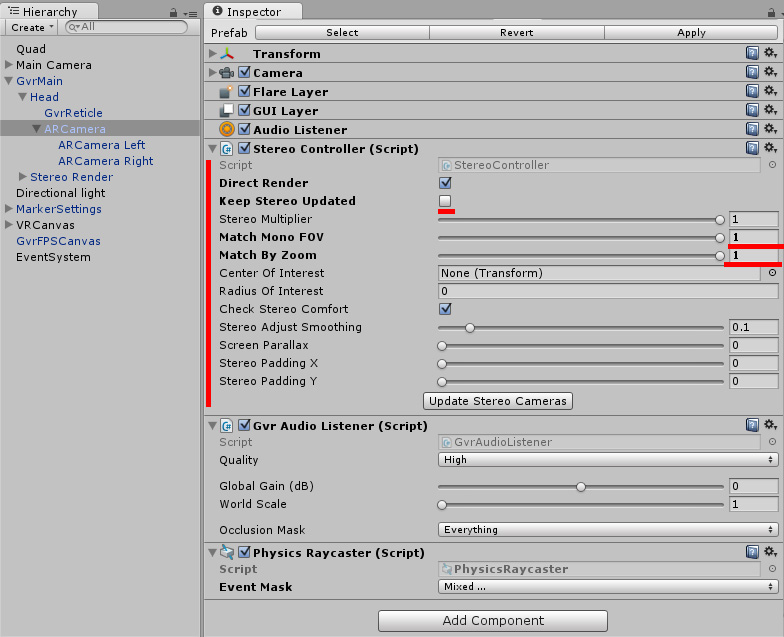

GoogleVR With OpenCVForUnity Example
====================

Screen Shot
-----

Environment
-----
Windows 8.1  
Unity 5.3.0f4  
OpenCVForUnity2.0.9  
GVR Unity SDK v1.0.3

Setup
-----
* Create New Project. (GoogleVRMarkerBasedARExample)
* Import OpenCVForUnity2.0.9 from AssetStore (if iOS platform, please use "OpenCVForUnity/Extra/ios_exclude_contrib.zip".)  
* Import MarkerBased AR Example1.2.0 from AssetStore  
* Import GoogleVRForUnity.unitypackage  
* Import GoogleVRWithOpenCVForUnityExample.unitypackage 
* Change Product Name. (GoogleVRMarkerBasedARExample)  
* Change PlayerSettings.bundleIdentifier. (xxx.xxxxxxx.googlevrmarkerbasedarexample)  
* Add the “Assets/GoogleVRWithOpenCVForUnityExample/Scenes/*.unity” files to “Scenes In Build” list in “Build Settings” window.
* Set In PlayerSettings, at the bottom under Settings for iOS, click Resolution and Presentation to expand that panel. Set the Default Orientation to Auto Rotation, and then uncheck all of the Allowed Orientations for Auto Rotation except for Landscape Left.

  
  
  
  
  
  

Android Build
-----
[GoogleVRWithOpenCVForUnityExample.apk](GoogleVRWithOpenCVForUnityExample.apk)

 

