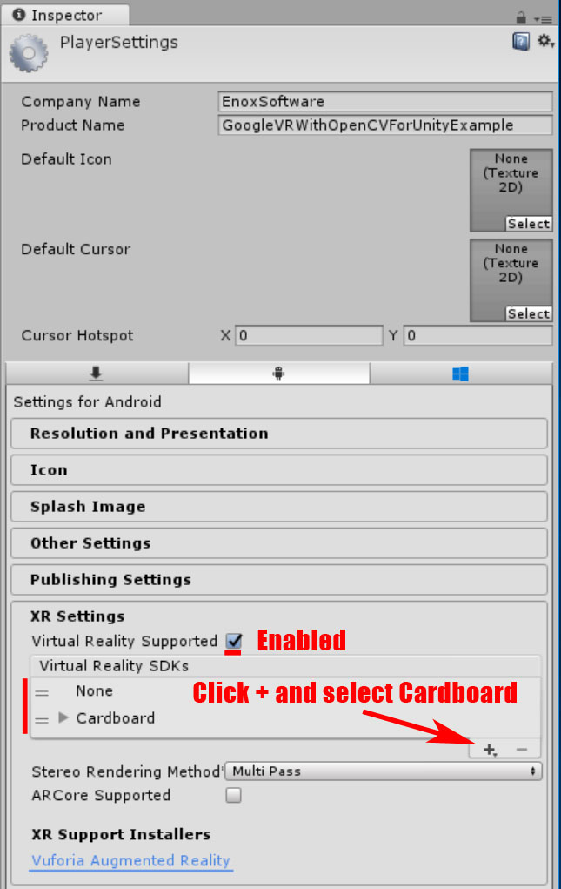

GoogleVR With OpenCVForUnity Example
====================

Screen Shot
-----

Environment
-----

- Anddroid (Pixel, Nexus 7) / iOS (iPhone8, iPhone6)
- Unity >= 2017.4+
- Scripting backend MONO / IL2CPP 
- [OpenCV for Unity](https://assetstore.unity.com/packages/tools/integration/opencv-for-unity-21088?aid=1011l4ehR) 2.3.4+
- [MarkerBased AR Example](https://assetstore.unity.com/packages/templates/tutorials/markerbased-ar-example-29678?aid=1011l4ehR) 1.2.2+
- [Google VR SDK for Unity](https://github.com/googlevr/gvr-unity-sdk/releases) v1.190.1

## Demo
- Android [GoogleVRWithOpenCVForUnityExample.apk](https://github.com/EnoxSoftware/GoogleVRWithOpenCVForUnityExample/releases)

Setup
-----
1. Download the latest release unitypackage. [GoogleVRWithOpenCVForUnityExample.unitypackage](https://github.com/EnoxSoftware/GoogleVRWithOpenCVForUnityExample/releases)
1. Create a new Project. (GoogleVRWithOpenCVForUnityExample)
1. Import OpenCVForUnity. 
    * Setup the OpenCVForUnity. (Tools > OpenCV for Unity > Set Plugin Import Settings)
1. Import MarkerBasedARExample.
1. Import GoogleVRForUnity_xxxxxxx.unitypackage  
1. Import GoogleVRWithOpenCVForUnityExample.unitypackage 
1. Add the “Assets/GoogleVRWithOpenCVForUnityExample/*.unity” files to “Scenes In Build” list in “Build Settings” window.
1. Set In PlayerSettings, at the bottom under Settings for iOS, click Resolution and Presentation to expand that panel. Set the Default Orientation to Auto Rotation, and then uncheck all of the Allowed Orientations for Auto Rotation except for Landscape Left.
1. Configure build settings and player settings. (See [Android](https://developers.google.com/vr/develop/unity/get-started-android) and [iOS](https://developers.google.com/vr/develop/unity/get-started-ios))
1. Build and Deploy to Android and iOS.

  
  

 

