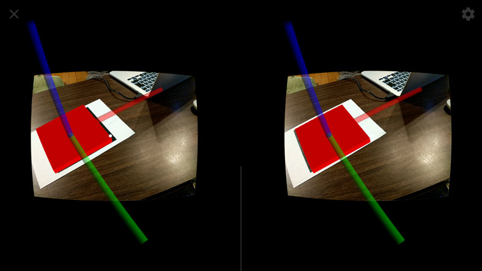

Cardboard With OpenCVForUnity Sample
====================

Screen Shot
-----

Environment
-----
Windows 8.1  
Unity 5.0.0f4  
OpenCVForUnity2.0.0
Cardboard SDK for Unity v0.6

Setup
-----
Create New Project CardboardMarkerBasedARSample

* Import MarkerBased AR Sample from AssetStore  
* Import OpenCVForUnity2.0.0 from AssetStore  
* Import CardboardSDKForUnity.unitypackage  
* Import CardboardWithOpenCVForUnitySample.unitypackage 

Change Product Name. CardboardMarkerBasedARSample
Change PlayerSettings.bundleIdentifier. com.enoxsoftware.cardboardmarkerbasedarsample

Please add the “CardboardWithOpenCVForUnitySample scene” to “Scenes In Build” list in “Build Settings” window.

